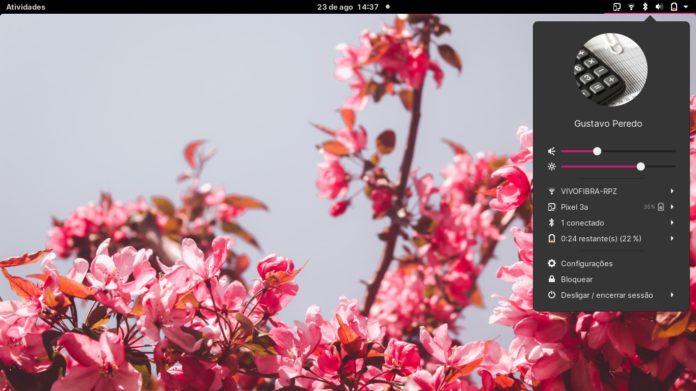

# Big avatar Gnome Shell Extension

A fork of [db0x's extension](https://github.com/db0x/bigavatar-db0x.de) that adds your user icon and name to your menu panel.

Now compatible with Gnome 40+.

**[Install Big Avatar now!](https://extensions.gnome.org/extension/3488/big-avatar/)**

