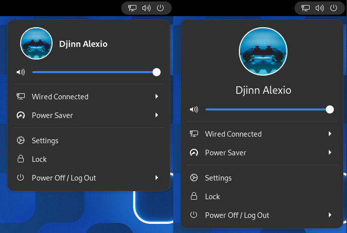
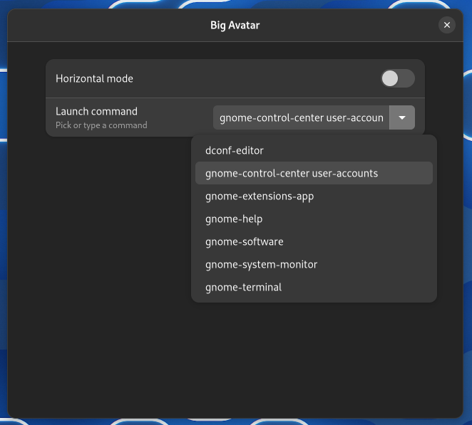

<h1 align = "center">
    Gnome Extension: Big Avatar
</h1>

<p align="center">
    
    
    
    <a href="LICENSE">
        
    </a>
    <a href="https://extensions.gnome.org/extension/3488/big-avatar/">
        
    </a>
</p>

This simple extension adds your username and icon to your menu panel.
It also allows you to launch an application or run a custom shell command.

- horizontal/vertical layout

- Launch an application/Run a shell command

- Compatible with Gnome 40 and later

<h2 align="center">
    <a href="https://extensions.gnome.org/extension/3488/big-avatar/">
    Click here to install Big Avatar now!
    </a>
</h2>





## Installation from Source

1. Download the zip and extract it, or clone the repository

2. Navigate to the folder

3. Get the UUID from `metadata.json`

    ```bash
    UUID=$(grep -E '^[ ]*"uuid":' ./metadata.json | \
    sed 's@^[ ]*"uuid":[ ]*"\(.\+\)",[ ]*@\1@')

    echo $UUID
    ```

4. Remove any previous version and install the extension

    ```bash
    rm -rfv $HOME/.local/share/gnome-shell/extensions/$UUID
    mkdir -v $HOME/.local/share/gnome-shell/extensions/$UUID
    cp -rv ./* $HOME/.local/share/gnome-shell/extensions/$UUID
    ```

5. Reload `gnome-shell`
   - Press **ALT+F2**, then enter **r** (not possible on Wayland)
   - or run `killall gnome-shell` (not possible on Wayland)
   - or log out, and re-login

6. Enable the extension

## TODO List

- [ ] ~~:sparkles: Implement **custom sizes for user icon and name**~~

- [x] :sparkles: Add Gtk3 compatibility

- [x] :sparkles: Implement **custom command**

## Notes

- This project is a fork of **[db0x's extension](https://github.com/db0x/bigavatar-db0x.de).**

- Huge thanks to **@djinnalexio** for his amazing contribution! He single handedly revived this extension!
